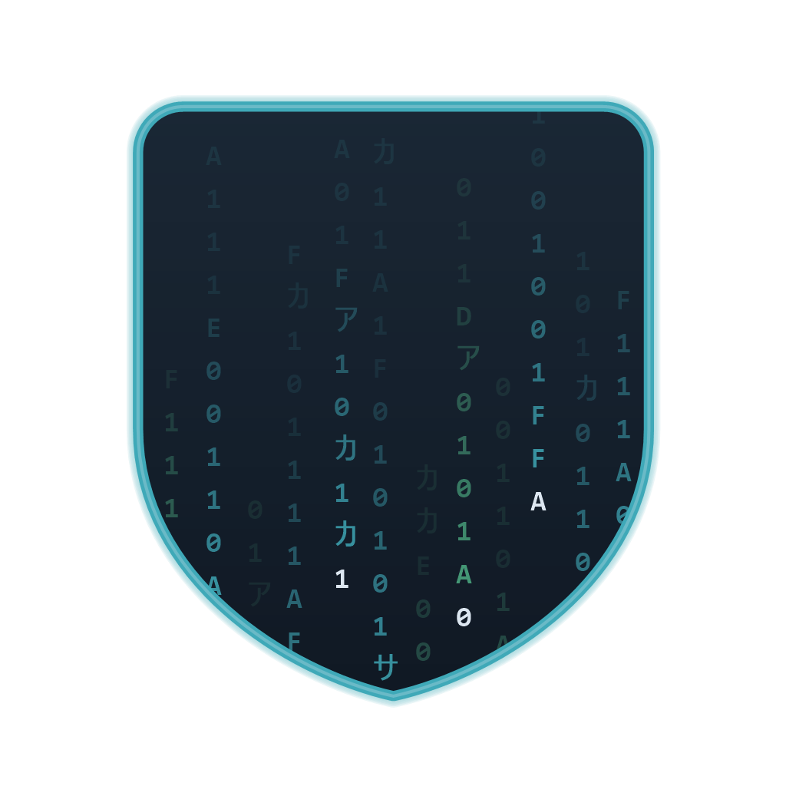
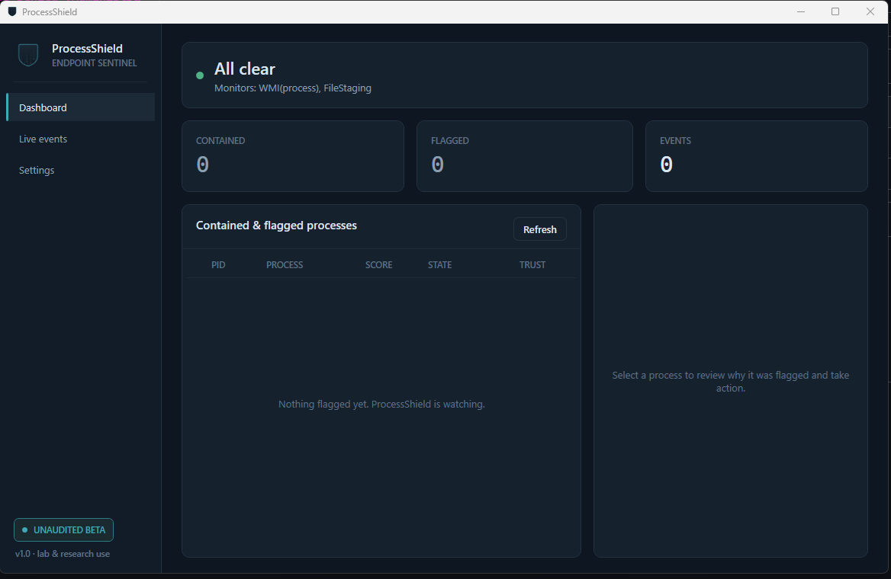

<div align="center">



# ProcessShield

**A user-mode behavioral endpoint agent for Windows that detects RAT & infostealer activity — then suspends, firewalls, and quarantines it.**

[](LICENSE)
[](https://dotnet.microsoft.com/)
[](#)
[](#-honest-scope)

</div>

<div align="center">

</div>

---

ProcessShield watches processes through an ETW kernel session (with a WMI fallback),
scores the classic **collect → archive → exfil** chain and remote-control indicators with
cross-signal correlation, and contains what crosses the line — **suspend-first**, then an
injection-safe firewall block and archive quarantine, with an optional kill. It ships both a
**console** and a **WPF desktop GUI**, a **Windows Service** host with a mutual watchdog, a
real **kernel minifilter** for inline prevention, YARA memory scanning, SIEM/audit telemetry,
and hot-reloadable policy.

## ⚠️ Honest scope

This is a **hardened prototype plus real integration layers** — not a shippable commercial
EDR. It runs, detects, and contains on a real machine, but two capabilities are gated behind
Microsoft programs and cannot be delivered as loadable artifacts here (see
[External gates](#external-gates-cannot-be-delivered-as-loadable-artifacts)). Use it for
labs, research, and learning. Red-team runs against live samples, perf/soak testing, and a
driver security review still stand between this and production.

## Features

| Area | What it does |
| --- | --- |
| **Monitoring** | ETW kernel session (process / image / file / TCP, IPv4 **and IPv6**, PID-attributed) with a WMI fallback, plus a `FileSystemWatcher` for archive staging. |
| **Detection** | Single-owner (actor) state machine — one thread mutates all profile state, so there are no data races. Correlates the exfil chain, LOLBin parent/child, command-line IOCs, and in-memory strings; thresholds hot-reload. |
| **Trust** | Full **Authenticode** verification (`WinVerifyTrust` chain validation + thumbprint pinning); allowlisted publishers get a scoring discount. Trust is only granted on a cryptographically valid chain. |
| **Response** | Suspend-first quarantine, injection-safe outbound firewall block, archive quarantine, optional kill — acting only on a **frozen** process so a reused PID is never wrongly hit. |
| **Memory** | Bounded builtin substring scanner (ASCII + UTF-16), or an optional YARA engine (`-p:EnableYara=true`). Scans run off the detection thread so they never stall it. |
| **Telemetry** | JSONL + syslog (RFC 5424) + HTTP webhook sinks, plus a **keyed (HMAC-SHA256) hash-chained audit log** with a head-anchor and verifier. |
| **Hosting** | Windows Service worker + heartbeat, a mutual **watchdog** that performs a real restart of a hung agent, and `sc.exe` / `schtasks` install/uninstall. |
| **Driver** | A real FS minifilter (`kernel/ShieldFilter/`) that denies opens of sensitive paths, driven by policy pushed from user mode. |
| **Front-ends** | A **console** analyst REPL and a **WPF GUI** with a live dashboard, event feed, and a settings editor. |

## Quick start

**Requirements:** Windows 10/11 x64, [.NET 8 SDK](https://dotnet.microsoft.com/download),
and **Administrator** rights at run time (ETW, process access, quarantine).

New here? Follow **[`GETTING_STARTED.md`](GETTING_STARTED.md)** for step-by-step Visual Studio
instructions plus a safe detection-simulation script. In short — open **`ProcessShield.sln`**
in Visual Studio 2022, set **Release / x64**, and Build Solution. CLI equivalents:

```bash
# Build everything
dotnet build ProcessShield.sln -c Release

# Run the tests
dotnet test tests/ProcessShield.Tests

# Console agent (from an elevated terminal)
dotnet run --project ProcessShield.csproj -c Release

# WPF desktop GUI
dotnet run --project gui/ProcessShield.Gui -c Release
```

Optional YARA engine (adds the dnYara dependency; the default build uses the builtin scanner):

```bash
dotnet build ProcessShield.csproj -c Release -p:EnableYara=true
```

### Run as a Windows Service

Publish a self-contained exe so the service `binPath` is the app itself, not `dotnet.exe`:

```bash
dotnet publish ProcessShield.csproj -c Release -r win-x64 --self-contained true
# then, from the publish folder, as Administrator:
ProcessShield.exe --install      # install + start the service (+ watchdog task)
ProcessShield.exe --uninstall    # stop + remove
```

## Analyst console

```
list [all]   show contained (or all flagged) processes
info N       full reason breakdown for entry N
resume N     un-suspend entry N (release a false positive)
suspend N    re-suspend entry N
kill N       terminate entry N (asks for confirmation)
stats        engine / queue counters
reload       re-read shield.config.json
audit        verify the tamper-evident audit log
quit         stop the agent and exit
```

## Configuration — `shield.config.json`

Thresholds, allowlist (publishers + pinned thumbprints), scan engine (`builtin` / `yara`),
telemetry sinks, and service/heartbeat settings. Editing the file **hot-reloads** the posture
and allowlist live (a malformed edit keeps the last-good config); scan-engine and telemetry
endpoint changes take effect on restart.

## Security model & honest limitations

- **Audit log integrity.** Records form a keyed HMAC-SHA256 hash chain with a head-anchor, so
  edits, reordering, interior deletion, and **tail truncation/emptying** are all detectable.
  The key lives on disk next to the log — this defeats an attacker who only has a copy of the
  log or can't read the key, so **protect the audit directory with an admin-only ACL**. It does
  *not* defeat a same-privilege attacker who can read the key. For proof against an
  equal-privilege adversary, forward every event off-box to an append-only SIEM (the
  `syslog`/`webhook` sinks) and reconcile against that remote head. See
  [`GETTING_STARTED.md` §11](GETTING_STARTED.md).
- **`kernelBlocking: true` is aggressive.** The skeleton driver denies *any* open of a
  sensitive path while blocking is on, including legitimate apps. Leave it off until the
  trusted-PID allowlist extension (see the driver README) is added.
- **Archive quarantine for ETW-detected files.** ETW reports `\Device\HarddiskVolumeN\...`
  paths that `System.IO` can't open directly, so the move-to-quarantine step no-ops for those
  (it fails safe; suspend + firewall containment still apply). Archives caught by the
  `FileSystemWatcher` use drive-letter paths and quarantine correctly.

### External gates (cannot be delivered as loadable artifacts)

- **Tamper protection via PPL/ELAM** requires being an approved anti-malware vendor with an
  ELAM driver attestation-signed by Microsoft. The watchdog + service recovery raise the bar,
  but an admin attacker can still kill both.
- **Production driver signing** needs attestation/WHQL or EV signing via the Partner Center
  plus a Microsoft-assigned altitude. The driver builds and runs in a test-signed lab as-is.

## Kernel minifilter

See [`kernel/ShieldFilter/README.md`](kernel/ShieldFilter/README.md) for building with the WDK,
lab test-signing, and loading. The agent connects via `MinifilterClient` and pushes policy; if
the driver isn't installed, kernel enforcement is simply unavailable and user-mode detection
continues.

## Tests

```bash
dotnet test tests/ProcessShield.Tests
```

Covers exfil-chain scoring, the trust discount, parent/child and command-line rules, the
pattern matcher (incl. cross-chunk), the firewall-name sanitizer, the audit hash chain
(intact / tamper / truncation / emptying / timestamp-tamper / re-forge), routable-address
classification (IPv4 + IPv6), config clamping, the off-thread memory-scan path, PID-reuse
reset, and `ActionResult`.

## Repository layout

```
ProcessShield.sln              Console + GUI + Tests (VS2022, x64)
├─ Program.cs, ProcessShield.csproj    console front-end + core library
├─ Monitoring/ Detection/ Response/    ETW/WMI → scoring actor → containment
├─ Memory/ Security/ Telemetry/        scanners, Authenticode, sinks + audit
├─ Hosting/ Configuration/ Native/     service/watchdog, config, P/Invoke
├─ gui/ProcessShield.Gui/              WPF desktop app (dashboard/events/settings)
├─ kernel/ShieldFilter/                C file-system minifilter (built with the WDK)
├─ rules/                              sample YARA rules
└─ tests/ProcessShield.Tests/          xUnit suite
```

## License

[MIT](LICENSE) © elemosecurity
